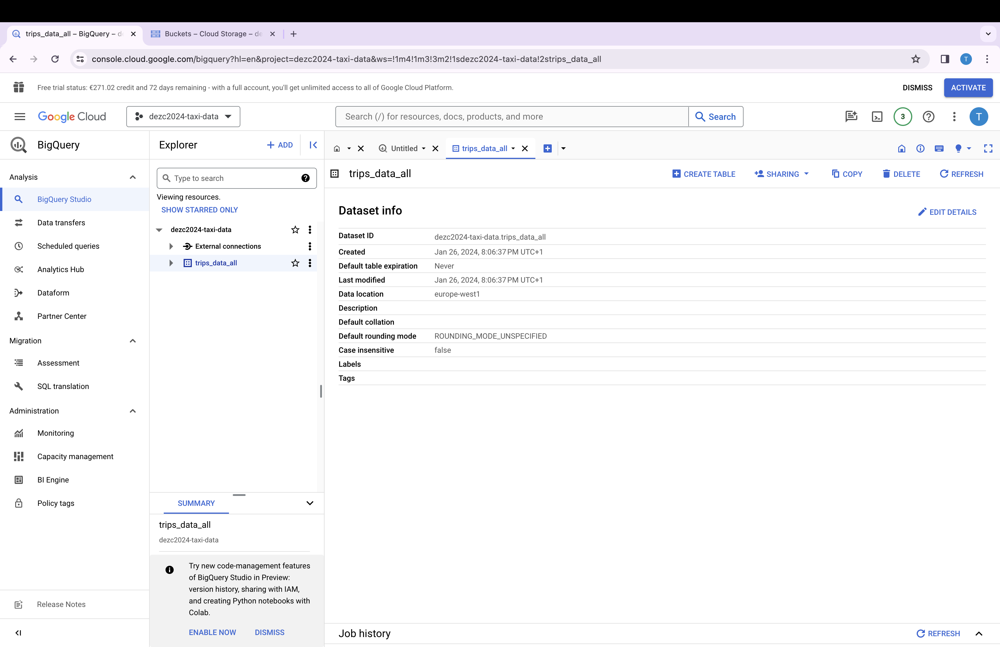
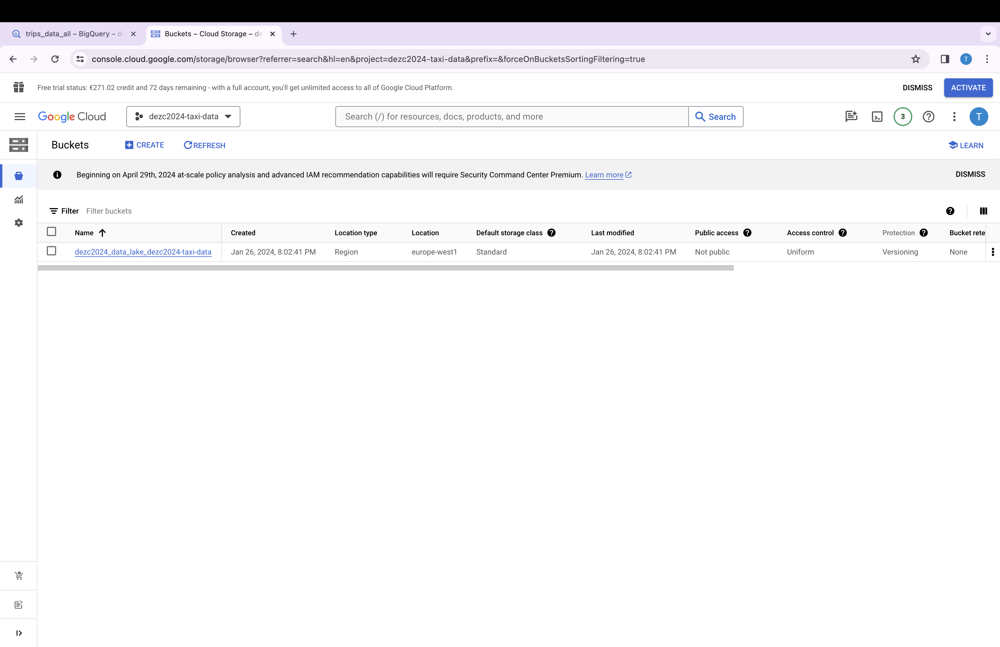

## Module 1 Homework

## Docker & SQL

In this homework we'll prepare the environment 
and practice with Docker and SQL


## Question 1. Knowing docker tags

Run the command to get information on Docker 

```docker --help```

Now run the command to get help on the "docker build" command:

```docker build --help```

Do the same for "docker run".

Which tag has the following text? - *Automatically remove the container when it exits* 

- `--delete`
- `--rc`
- `--rmc`
- `--rm`   - this one


## Question 2. Understanding docker first run 

Run docker with the python:3.9 image in an interactive mode and the entrypoint of bash.
Now check the python modules that are installed ( use ```pip list``` ). 

What is version of the package *wheel* ?

- 0.42.0   - this one
- 1.0.0
- 23.0.1
- 58.1.0


# Prepare Postgres

Run Postgres and load data as shown in the videos
We'll use the green taxi trips from September 2019:

```wget https://github.com/DataTalksClub/nyc-tlc-data/releases/download/green/green_tripdata_2019-09.csv.gz```

You will also need the dataset with zones:

```wget https://s3.amazonaws.com/nyc-tlc/misc/taxi+_zone_lookup.csv```

Download this data and put it into Postgres (with jupyter notebooks or with a pipeline)


## Question 3. Count records 
I load the data with the following commands:


```$ URL="https://github.com/DataTalksClub/nyc-tlc-data/releases/download/green/green_tripdata_2019-09.csv.gz" ```

```
$ python ingest_green_data.py \
    --user=root \
    --password=root \
    --host=localhost \
    --port=5432 \
    --db=ny_taxi \
    --table_name=green_taxi_trips \
    --url=${URL}

````

Tip: started and finished on 2019-09-18. 

Remember that `lpep_pickup_datetime` and `lpep_dropoff_datetime` columns are in the format timestamp (date and hour+min+sec) and not in date.

How many taxi trips were totally made on September 18th 2019

The query:
```
SELECT Count(1)
FROM   public.green_taxi_trips
WHERE  lpep_pickup_datetime >= '2019-09-18 00:00:00'
       AND lpep_pickup_datetime < '2019-09-19 00:00:00'
````

- 15767 - this one the answer
- 15612
- 15859
- 89009

## Question 4. Largest trip for each day

Which was the pick up day with the largest trip distance
Use the pick up time for your calculations.

The query:
```
SELECT *
FROM   public.green_taxi_trips
WHERE  trip_distance IN (SELECT Max(trip_distance)
                         FROM   public.green_taxi_trips) 
```
- 2019-09-18
- 2019-09-16
- 2019-09-26 - this one the answer
- 2019-09-21


## Question 5. Three biggest pick up Boroughs

Consider lpep_pickup_datetime in '2019-09-18' and ignoring Borough has Unknown

Which were the 3 pick up Boroughs that had a sum of total_amount superior to 50000?
 
The query:
```
SELECT z."Borough",
       Sum(total_amount) AS total_amount
FROM   public.green_taxi_trips t
JOIN   public.zones
    ON t."pulocationid" = z."LocationID"
WHERE  z."Borough" != 'Unknown'
    AND Cast(t.lpep_pickup_datetime AS date) = '2019-09-18'
GROUP  BY z."Borough"
HAVING Sum(total_amount) > 50000 

```

- "Brooklyn" "Manhattan" "Queens" - this one the answer
- "Bronx" "Brooklyn" "Manhattan"
- "Bronx" "Manhattan" "Queens" 
- "Brooklyn" "Queens" "Staten Island"


## Question 6. Largest tip

For the passengers picked up in September 2019 in the zone name Astoria which was the drop off zone that had the largest tip?
We want the name of the zone, not the id.

Note: it's not a typo, it's `tip` , not `trip`

-- For the passengers picked up in September 2019 in the zone name Astoria which was the drop off zone that had the largest tip?
-- We want the name of the zone, not the id.

The query (It's not the best one  with regard to perfomance, but because the datdset not so big I used  order by clause):

```
;WITH max_tips
AS
  (
           SELECT   zdo."Zone",
                    max(tip_amount) AS "max_tip"
           FROM     public.green_taxi_trips t
           JOIN     public.zones zpu
           ON       t."PULocationID" = zpu."LocationID"
           JOIN     public.zones zdo
           ON       t."DOLocationID" = zdo."LocationID"
           WHERE    zpu."Zone" = 'Astoria'
           AND      cast(t.lpep_pickup_datetime AS date) >= '2019-08-30'
           AND      cast(t.lpep_pickup_datetime AS date) < '2019-10-01'
           GROUP BY zdo."Zone" )
  SELECT   *
  FROM     max_tips tp
  ORDER BY tp."max_tip" DESC
  LIMIT    1
```

- Central Park
- Jamaica
- JFK Airport - this one the answer
- Long Island City/Queens Plaza


## Terraform

In this section homework we'll prepare the environment by creating resources in GCP with Terraform.

In your VM on GCP/Laptop/GitHub Codespace install Terraform. 
Copy the files from the course repo
[here](https://github.com/DataTalksClub/data-engineering-zoomcamp/tree/main/01-docker-terraform/1_terraform_gcp/terraform) to your VM/Laptop/GitHub Codespace.

Modify the files as necessary to create a GCP Bucket and Big Query Dataset.

File **main.tf**

```
terraform {
  required_version = ">= 1.0"
  backend "local" {}  # Can change from "local" to "gcs" (for google) or "s3" (for aws), if you would like to preserve your tf-state online
  required_providers {
    google = {
      source  = "hashicorp/google"
    }
  }
}

provider "google" {
  project = var.project
  region = var.region// 
  ##credentials = "${file("/Users/tetianaomelchenko/opt/gcp/dezc2024-taxi-data-d5efc3c82183.json")}"  # Use this if you do not want to set env-var GOOGLE_APPLICATION_CREDENTIALS. I tried both variants. Both worked.
}

# Data Lake Bucket
# Ref: https://registry.terraform.io/providers/hashicorp/google/latest/docs/resources/storage_bucket
resource "google_storage_bucket" "data-lake-bucket" {
  name          = "${local.data_lake_bucket}_${var.project}" # Concatenating DL bucket & Project name for unique naming
  location      = var.region

  # Optional, but recommended settings:
  storage_class = var.storage_class
  uniform_bucket_level_access = true

  versioning {
    enabled     = true
  }

  lifecycle_rule {
    action {
      type = "Delete"
    }
    condition {
      age = 30  // days
    }
  }

  force_destroy = true
}

# DWH
# Ref: https://registry.terraform.io/providers/hashicorp/google/latest/docs/resources/bigquery_dataset
resource "google_bigquery_dataset" "dataset" {
  dataset_id = var.BQ_DATASET
  project    = var.project
  location   = var.region
}
```


File **varibles.tf**

```
locals {
  data_lake_bucket = "dezc2024_data_lake"
}

variable "project" {
  description = "dezc2024-taxi-data"
}

variable "region" {
  description = "Region for GCP resources. Choose as per your location: https://cloud.google.com/about/locations"
  default = "europe-west1"
  type = string
}

# Not needed for now
# variable "bucket_name" {
#   description = "The name of the GCS bucket. Must be globally unique."
#   default = ""
# }

variable "storage_class" {
  description = "Storage class type for your bucket. Check official docs for more info."
  default = "STANDARD"
}

variable "BQ_DATASET" {
  description = "BigQuery Dataset that raw data (from GCS) will be written to"
  type = string
  default = "trips_data_all"
}

variable "TABLE_NAME" {
  description = "BigQuery Table"
  type = string
  default = "ny_trips"
}

```


## Question 7. Creating Resources

After updating the main.tf and variable.tf files run:

```
terraform apply
```
On the first try, I got an error:

```
Error: Error creating Dataset: googleapi: Error 403: BigQuery API has not been used in project 1062705873896 before or it is disabled. Enable it by visiting https://console.developers.google.com/apis/api/bigquery.googleapis.com/overview?project=1062705873896 then retry. If you enabled this API recently, wait a few minutes for the action to propagate to our systems and retry. 
```

So I had to enable BigQuery API and run again.

```
The result:


(base) tetianaomelchenko@Tetianas-Air 1_terraform_gcp % terraform apply 
var.project
  dezc2024-taxi-data

  Enter a value: dezc2024-taxi-data


Terraform used the selected providers to generate the following execution plan. Resource actions
are indicated with the following symbols:
  + create

Terraform will perform the following actions:

  # google_bigquery_dataset.dataset will be created
  + resource "google_bigquery_dataset" "dataset" {
      + creation_time              = (known after apply)
      + dataset_id                 = "trips_data_all"
      + default_collation          = (known after apply)
      + delete_contents_on_destroy = false
      + effective_labels           = (known after apply)
      + etag                       = (known after apply)
      + id                         = (known after apply)
      + is_case_insensitive        = (known after apply)
      + last_modified_time         = (known after apply)
      + location                   = "europe-west1"
      + max_time_travel_hours      = (known after apply)
      + project                    = "dezc2024-taxi-data"
      + self_link                  = (known after apply)
      + storage_billing_model      = (known after apply)
      + terraform_labels           = (known after apply)
    }

  # google_storage_bucket.data-lake-bucket will be created
  + resource "google_storage_bucket" "data-lake-bucket" {
      + effective_labels            = (known after apply)
      + force_destroy               = true
      + id                          = (known after apply)
      + location                    = "EUROPE-WEST1"
      + name                        = "dezc2024_data_lake_dezc2024-taxi-data"
      + project                     = (known after apply)
      + public_access_prevention    = (known after apply)
      + rpo                         = (known after apply)
      + self_link                   = (known after apply)
      + storage_class               = "STANDARD"
      + terraform_labels            = (known after apply)
      + uniform_bucket_level_access = true
      + url                         = (known after apply)

      + lifecycle_rule {
          + action {
              + type = "Delete"
            }
          + condition {
              + age                   = 30
              + matches_prefix        = []
              + matches_storage_class = []
              + matches_suffix        = []
              + with_state            = (known after apply)
            }
        }

      + versioning {
          + enabled = true
        }
    }

Plan: 2 to add, 0 to change, 0 to destroy.

Do you want to perform these actions?
  Terraform will perform the actions described above.
  Only 'yes' will be accepted to approve.

  Enter a value: yes

google_bigquery_dataset.dataset: Creating...
google_storage_bucket.data-lake-bucket: Creating...
google_storage_bucket.data-lake-bucket: Creation complete after 1s [id=dezc2024_data_lake_dezc2024-taxi-data]
google_bigquery_dataset.dataset: Creation complete after 2s [id=projects/dezc2024-taxi-data/datasets/trips_data_all]

Apply complete! Resources: 2 added, 0 changed, 0 destroyed.
```




## Submitting the solutions

* Form for submitting: https://courses.datatalks.club/de-zoomcamp-2024/homework/hw01
* You can submit your homework multiple times. In this case, only the last submission will be used. 

Deadline: 29 January, 23:00 CET